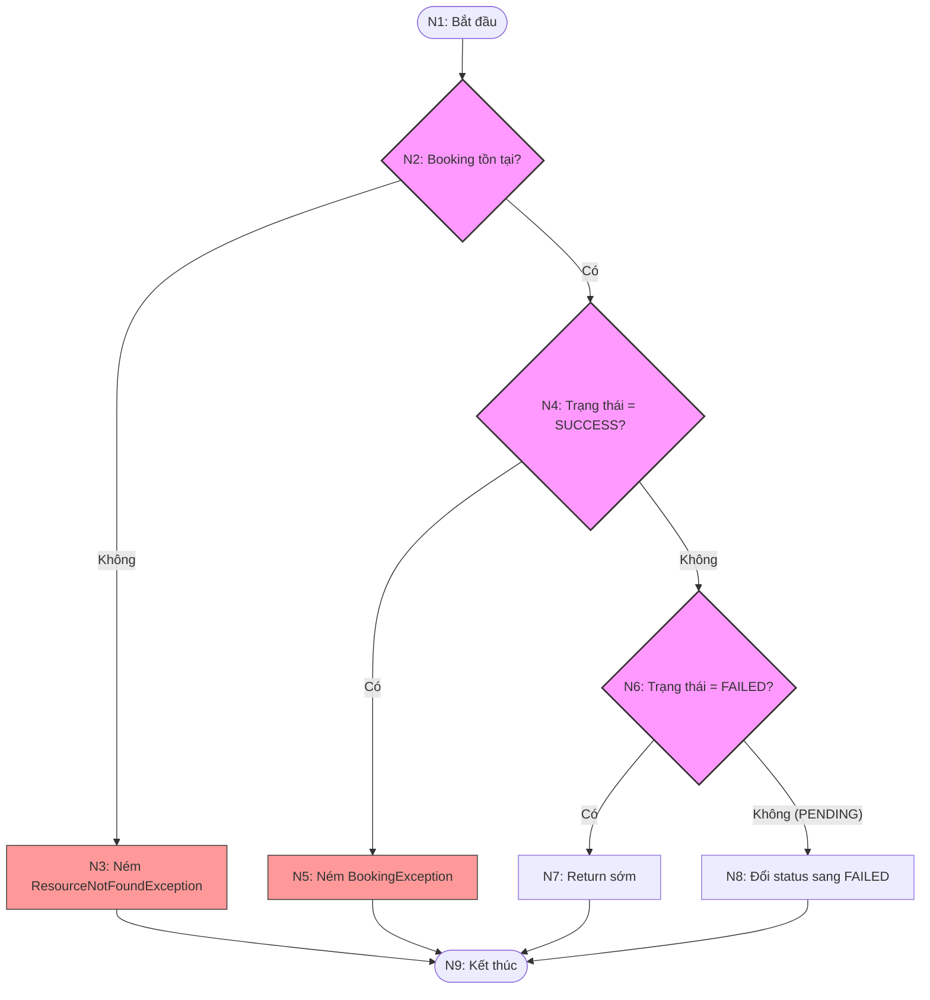

# KIỂM THỬ HỘP TRẮNG HÀM `cancelBooking`

Tài liệu này chứa báo cáo phân tích và thiết kế kịch bản kiểm thử hộp trắng (White-box Testing) cho phương thức `cancelBooking` thuộc lớp [BookingServiceImpl](file:///d:/NNLTTT/FinalProject/MeCinema/src/main/java/com/mecinema/mecinema/service/impl/BookingServiceImpl.java).

---

## 6.12.1. Mã nguồn chi tiết của hàm

Phương thức `cancelBooking` được định nghĩa trong [BookingServiceImpl.java](file:///d:/NNLTTT/FinalProject/MeCinema/src/main/java/com/mecinema/mecinema/service/impl/BookingServiceImpl.java#L109-L123) như sau:

```java
    @Override
    @Transactional
    public void cancelBooking(Long userId, Long bookingId) {
        Booking booking = bookingRepository.findByIdAndUserId(bookingId, userId)
                .orElseThrow(() -> new ResourceNotFoundException("Booking not found"));

        if (booking.getStatus() == Status.SUCCESS) {
            throw new BookingException("Cannot cancel a completed booking.");
        }

        if (booking.getStatus() == Status.FAILED) {
            return; // Already cancelled/expired — nothing to do
        }

        booking.setStatus(Status.FAILED);
        // bookingRepository.save() is implicit within @Transactional dirty-checking
    }
```

---

## 6.12.2. Đồ thị dòng điều khiển cơ bản (Control Flow Graph - CFG)

Để xây dựng Đồ thị dòng điều khiển (CFG), chúng ta phân tích các cấu trúc rẽ nhánh, câu lệnh kiểm tra điều kiện và các điểm thoát ra khỏi hàm.

### 1. Danh sách các nút (Nodes) trong đồ thị

*   **Nút 1 (N1):** Bắt đầu hàm (Entry), thực hiện gọi phương thức truy vấn DB để tìm Booking: `bookingRepository.findByIdAndUserId(bookingId, userId)`.
*   **Nút 2 (N2 - Predicate Node):** Kiểm tra xem Booking có tồn tại hay không (`orElseThrow`)?
    *   *Không tồn tại:* Đi tới **Nút 3**.
    *   *Có tồn tại:* Đi tới **Nút 4**.
*   **Nút 3 (N3):** Ném ngoại lệ `ResourceNotFoundException`. Đi tới **Nút 9 (Unified Exit)**.
*   **Nút 4 (N4 - Predicate Node):** Kiểm tra trạng thái Booking có phải là `SUCCESS` hay không (`booking.getStatus() == Status.SUCCESS`)?
    *   *Đúng:* Đi tới **Nút 5**.
    *   *Sai:* Đi tới **Nút 6**.
*   **Nút 5 (N5):** Ném ngoại lệ `BookingException`. Đi tới **Nút 9 (Unified Exit)**.
*   **Nút 6 (N6 - Predicate Node):** Kiểm tra trạng thái Booking có phải là `FAILED` hay không (`booking.getStatus() == Status.FAILED`)?
    *   *Đúng:* Đi tới **Nút 7**.
    *   *Sai:* Đi tới **Nút 8**.
*   **Nút 7 (N7):** Trả về sớm (Early return), không thực hiện bất kỳ thay đổi nào. Đi tới **Nút 9 (Unified Exit)**.
*   **Nút 8 (N8):** Đổi trạng thái Booking sang `FAILED`: `booking.setStatus(Status.FAILED)`. Đi tới **Nút 9 (Unified Exit)**.
*   **Nút 9 (N9 - Unified Exit):** Kết thúc chương trình. Đây là điểm kết thúc chung cho mọi nhánh xử lý (bao gồm các ngoại lệ ở N3, N5, return sớm ở N7, và hoàn thành ở N8).

---

### 2. Biểu đồ dòng điều khiển (Mermaid Flowchart)



---

## 6.12.3. Tính toán độ phức tạp Cyclomatic

Chúng ta tính toán Độ phức tạp McCabe Cyclomatic ($V(G)$) cho phương thức `cancelBooking` bằng 3 phương pháp tiêu chuẩn:

### Phương pháp 1: Dựa trên số cạnh (Edges) và số nút (Nodes)
Công thức:
$$V(G) = E - V + 2P$$
Trong đó:
*   $E$ là số cạnh trong đồ thị: $E = 11$ cạnh.
    *(Các cạnh: $1 \to 2$, $2 \to 3$, $2 \to 4$, $3 \to 9$, $4 \to 5$, $4 \to 6$, $5 \to 9$, $6 \to 7$, $6 \to 8$, $7 \to 9$, $8 \to 9$)*
*   $V$ là số nút trong đồ thị: $V = 9$ nút.
    *(Các nút: $N_1, N_2, N_3, N_4, N_5, N_6, N_7, N_8, N_9$)*
*   $P$ là số thành phần liên thông: $P = 1$.

Thay số vào công thức:
$$V(G) = 11 - 9 + 2(1) = 4$$

### Phương pháp 2: Dựa trên số nút quyết định (Predicate Nodes)
Công thức:
$$V(G) = d + 1$$
Trong đó $d$ là số nút quyết định rẽ luồng thực thi trong đồ thị. Hàm có 3 nút quyết định:
1.  **N2:** Kiểm tra Booking tồn tại.
2.  **N4:** Kiểm tra Booking đã ở trạng thái `SUCCESS`.
3.  **N6:** Kiểm tra Booking đã ở trạng thái `FAILED`.

Số nút quyết định $d = 3$. Thay số vào công thức:
$$V(G) = 3 + 1 = 4$$

### Phương pháp 3: Dựa trên số vùng phẳng (Regions)
Đồ thị phân hoạch mặt phẳng thành các vùng độc lập:
*   **Vùng 1 (Region 1):** Vùng giới hạn bởi đường đi lỗi phòng chiếu/ngoại lệ 1 ($N_2 \to N_3 \to N_9$) và phần luồng chính.
*   **Vùng 2 (Region 2):** Vùng giới hạn bởi nhánh ngoại lệ trạng thái thành công ($N_4 \to N_5 \to N_9$) và phần luồng chính.
*   **Vùng 3 (Region 3):** Vùng giới hạn bởi nhánh rẽ trạng thái thất bại ($N_6 \to N_7 \to N_9$) và nhánh cập nhật thành công ($N_6 \to N_8 \to N_9$).
*   **Vùng 4 (Region 4):** Vùng không gian mở vô hạn bên ngoài đồ thị.

Số vùng phẳng $R = 4$. Theo lý thuyết đồ thị:
$$V(G) = R = 4$$

### Kết luận
Cả 3 phương pháp đều thống nhất độ phức tạp McCabe Cyclomatic của hàm là **$V(G) = 4$**. Cần thiết kế đúng **4 kịch bản kiểm thử (Test Cases)** độc lập để đạt độ bao phủ toàn diện 100% các nhánh.

---

## 6.12.4. Thiết kế bộ Test Case đối với mỗi nhánh độc lập

### 1. Danh sách các đường đi độc lập (Basis Paths)

*   **Path 1:** $N_1 \to N_2 \to N_3 \to N_9$
    *   *Kịch bản:* Người dùng cố hủy đặt vé với ID hoặc User ID không trùng khớp (Không tìm thấy booking trong hệ thống). Hàm ném lỗi `ResourceNotFoundException`.
*   **Path 2:** $N_1 \to N_2 \to N_4 \to N_5 \to N_9$
    *   *Kịch bản:* Booking tồn tại nhưng đã thanh toán thành công (`SUCCESS`). Không cho phép hủy, hàm ném lỗi `BookingException`.
*   **Path 3:** $N_1 \to N_2 \to N_4 \to N_6 \to N_7 \to N_9$
    *   *Kịch bản:* Booking tồn tại nhưng trạng thái đã là `FAILED` (đã bị hủy hoặc hết hạn trước đó). Hàm kết thúc sớm bằng lệnh return, không thực hiện chỉnh sửa gì (đảm bảo tính Idempotency).
*   **Path 4:** $N_1 \to N_2 \to N_4 \to N_6 \to N_8 \to N_9$
    *   *Kịch bản:* Booking tồn tại ở trạng thái hợp lệ để hủy (ví dụ `PENDING`). Hàm cập nhật trạng thái Booking sang `FAILED`.

---

### 2. Thiết kế chi tiết các Test Cases

#### TC_WBT_005 (Bao phủ Path 1): Hủy đặt vé thất bại do Booking ID không tồn tại hoặc không khớp User ID

| **Test Case ID** | **TC_WBT_005** | **Test Case Description** | **Kiểm tra hủy đặt vé thất bại khi không tìm thấy Booking phù hợp trong database** |
| :--- | :--- | :--- | :--- |
| **Tested Function** | `cancelBooking` | **Type of Test** | White-box / Path Coverage (Path 1) |
| **Created By** | Thái | **Reviewed By** | Minh |
| **Version** | 1.0 | **Test Status** | **Pass** |

##### 1. Dữ liệu kiểm thử & Mocking
*   **Input Parameters:**
    *   `userId`: `10L`
    *   `bookingId`: `999L`
*   **Mock Behavior:**
    *   `bookingRepository.findByIdAndUserId(999L, 10L)` trả về `Optional.empty()`.

##### 2. Các bước thực hiện và Kết quả kỳ vọng
| **Bước** | **Chi tiết các bước thực hiện** | **Kết quả mong đợi (Expected Results)** | **Kết quả thực tế (Actual Results)** | **Trạng thái** |
| :--- | :--- | :--- | :--- | :--- |
| 1 | Gọi phương thức `cancelBooking(10L, 999L)`. | Hệ thống tìm kiếm booking và ném lỗi `ResourceNotFoundException`. | Kết quả đúng mong đợi | Pass |
| 2 | Kiểm tra chi tiết ngoại lệ được ném ra. | Ngoại lệ `ResourceNotFoundException` với thông báo `"Booking not found"`. | Đúng ngoại lệ và nội dung thông báo | Pass |
| 3 | Xác minh các lời gọi repository. | - `bookingRepository.findByIdAndUserId` được gọi **1 lần**.<br>- Không thực hiện thay đổi trạng thái hay lưu trữ gì khác. | Xác minh Mock chính xác | Pass |

---

#### TC_WBT_006 (Bao phủ Path 2): Hủy đặt vé thất bại do Booking đã thanh toán thành công (SUCCESS)

| **Test Case ID** | **TC_WBT_006** | **Test Case Description** | **Kiểm tra ngăn chặn hủy đơn đặt vé đã thanh toán thành công** |
| :--- | :--- | :--- | :--- |
| **Tested Function** | `cancelBooking` | **Type of Test** | White-box / Path Coverage (Path 2) |
| **Created By** | Thái | **Reviewed By** | Minh |
| **Version** | 1.0 | **Test Status** | **Pass** |

##### 1. Dữ liệu kiểm thử & Mocking
*   **Input Parameters:**
    *   `userId`: `10L`
    *   `bookingId`: `1L`
*   **Mock Behavior:**
    *   Tạo thực thể `Booking mockBooking` có `id = 1L`, `status = Status.SUCCESS`.
    *   `bookingRepository.findByIdAndUserId(1L, 10L)` trả về `Optional.of(mockBooking)`.

##### 2. Các bước thực hiện và Kết quả kỳ vọng
| **Bước** | **Chi tiết các bước thực hiện** | **Kết quả mong đợi (Expected Results)** | **Kết quả thực tế (Actual Results)** | **Trạng thái** |
| :--- | :--- | :--- | :--- | :--- |
| 1 | Gọi phương thức `cancelBooking(10L, 1L)`. | Hàm lấy thông tin Booking, thấy trạng thái `SUCCESS` và dừng lại ném lỗi. | Kết quả đúng mong đợi | Pass |
| 2 | Kiểm tra chi tiết ngoại lệ được ném ra. | Ngoại lệ `BookingException` với thông báo `"Cannot cancel a completed booking."`. | Đúng ngoại lệ và nội dung thông báo | Pass |
| 3 | Xác minh trạng thái của Booking mock. | Trạng thái của `mockBooking` vẫn giữ nguyên là `SUCCESS` (không thay đổi). | Trạng thái không bị đổi | Pass |

---

#### TC_WBT_007 (Bao phủ Path 3): Hủy đặt vé đã bị hủy/thất bại trước đó (FAILED)

| **Test Case ID** | **TC_WBT_007** | **Test Case Description** | **Đảm bảo tính idempotent: Hủy một đơn hàng đã FAILED trước đó kết thúc êm đẹp và không đổi trạng thái** |
| :--- | :--- | :--- | :--- |
| **Tested Function** | `cancelBooking` | **Type of Test** | White-box / Path Coverage (Path 3) |
| **Created By** | Thái | **Reviewed By** | Minh |
| **Version** | 1.0 | **Test Status** | **Pass** |

##### 1. Dữ liệu kiểm thử & Mocking
*   **Input Parameters:**
    *   `userId`: `10L`
    *   `bookingId`: `2L`
*   **Mock Behavior:**
    *   Tạo thực thể `Booking mockBooking` có `id = 2L`, `status = Status.FAILED`.
    *   `bookingRepository.findByIdAndUserId(2L, 10L)` trả về `Optional.of(mockBooking)`.

##### 2. Các bước thực hiện và Kết quả kỳ vọng
| **Bước** | **Chi tiết các bước thực hiện** | **Kết quả mong đợi (Expected Results)** | **Kết quả thực tế (Actual Results)** | **Trạng thái** |
| :--- | :--- | :--- | :--- | :--- |
| 1 | Gọi phương thức `cancelBooking(10L, 2L)`. | Hàm phát hiện trạng thái là `FAILED` và trả về sớm (return), không làm gì thêm. | Kết quả đúng mong đợi | Pass |
| 2 | Kiểm tra kết quả trả về và ngoại lệ. | Không có lỗi nào được ném ra, hàm kết thúc bình thường. | Hàm kết thúc thành công | Pass |
| 3 | Xác minh trạng thái của Booking mock. | Trạng thái của `mockBooking` vẫn giữ nguyên là `FAILED`. | Trạng thái không đổi | Pass |

---

#### TC_WBT_008 (Bao phủ Path 4): Hủy đặt vé thành công khi đơn ở trạng thái PENDING

| **Test Case ID** | **TC_WBT_008** | **Test Case Description** | **Kiểm tra hủy đặt vé thành công từ trạng thái PENDING sang trạng thái FAILED** |
| :--- | :--- | :--- | :--- |
| **Tested Function** | `cancelBooking` | **Type of Test** | White-box / Path Coverage (Path 4) |
| **Created By** | Thái | **Reviewed By** | Minh |
| **Version** | 1.0 | **Test Status** | **Pass** |

##### 1. Dữ liệu kiểm thử & Mocking
*   **Input Parameters:**
    *   `userId`: `10L`
    *   `bookingId`: `3L`
*   **Mock Behavior:**
    *   Tạo thực thể `Booking mockBooking` có `id = 3L`, `status = Status.PENDING`.
    *   `bookingRepository.findByIdAndUserId(3L, 10L)` trả về `Optional.of(mockBooking)`.

##### 2. Các bước thực hiện và Kết quả kỳ vọng
| **Bước** | **Chi tiết các bước thực hiện** | **Kết quả mong đợi (Expected Results)** | **Kết quả thực tế (Actual Results)** | **Trạng thái** |
| :--- | :--- | :--- | :--- | :--- |
| 1 | Gọi phương thức `cancelBooking(10L, 3L)`. | Hàm kiểm tra hợp lệ và tiến hành cập nhật trạng thái đơn đặt vé. | Kết quả đúng mong đợi | Pass |
| 2 | Kiểm tra kết quả cập nhật trạng thái. | Trạng thái của đối tượng `mockBooking` được cập nhật chính xác từ `PENDING` thành `FAILED`. | Trạng thái chuyển thành FAILED | Pass |
| 3 | Xác minh lời gọi repository. | Lời gọi `bookingRepository.findByIdAndUserId` diễn ra đúng **1 lần**. | Xác minh Mock chính xác | Pass |
