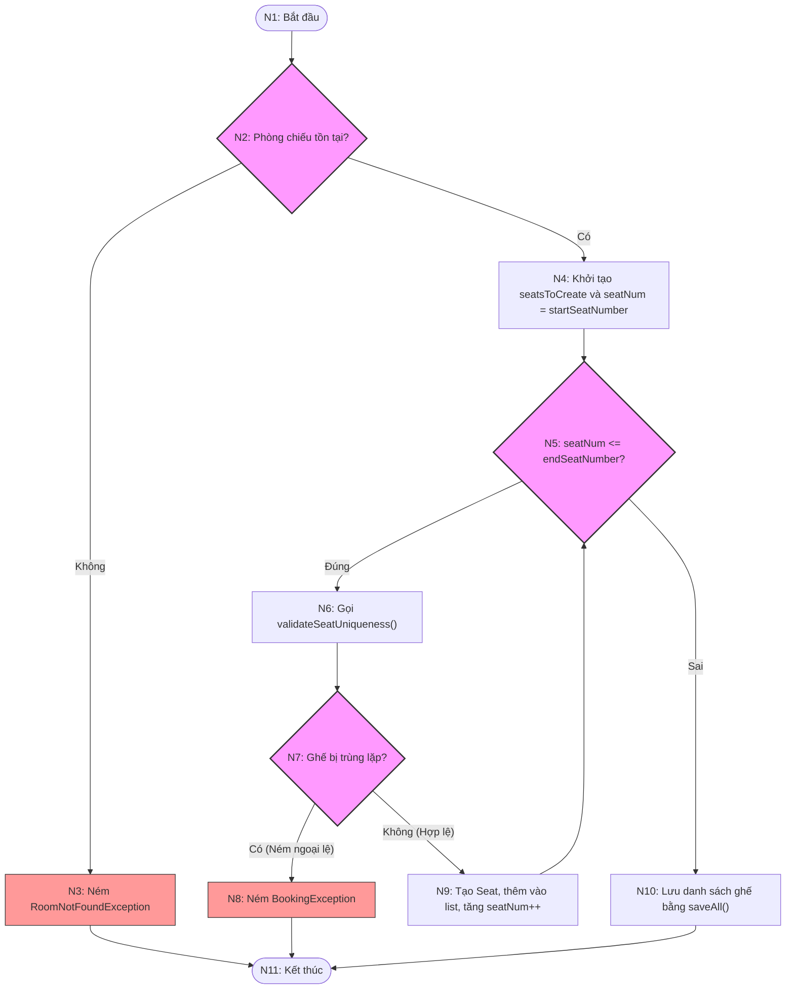

# KIỂM THỬ HỘP TRẮNG HÀM `createSeatsInBulk`

Tài liệu này chứa báo cáo phân tích và thiết kế kịch bản kiểm thử hộp trắng (White-box Testing) cho phương thức `createSeatsInBulk` thuộc lớp [SeatManagementServiceImpl](file:///d:/NNLTTT/FinalProject/MeCinema/src/main/java/com/mecinema/mecinema/service/impl/SeatManagementServiceImpl.java).

---

## 6.12.1. Mã nguồn chi tiết của hàm

Phương thức `createSeatsInBulk` được định nghĩa trong [SeatManagementServiceImpl.java](file:///d:/NNLTTT/FinalProject/MeCinema/src/main/java/com/mecinema/mecinema/service/impl/SeatManagementServiceImpl.java#L60-L91) như sau:

```java
    @Override
    public List<SeatDto> createSeatsInBulk(BulkCreateSeatsDto bulkCreateSeatsDto) {
        // Validate room exists
        Room room = roomRepository.findById(bulkCreateSeatsDto.getRoomId())
                .orElseThrow(() -> new RoomNotFoundException(
                        "Phòng chiếu với ID: " + bulkCreateSeatsDto.getRoomId() + " không tồn tại"));

        List<Seat> seatsToCreate = new ArrayList<>();
        
        // Create seats for the range
        for (int seatNum = bulkCreateSeatsDto.getStartSeatNumber(); 
             seatNum <= bulkCreateSeatsDto.getEndSeatNumber(); seatNum++) {
            
            // Validate each seat uniqueness
            seatValidationService.validateSeatUniqueness(
                    bulkCreateSeatsDto.getRoomId(),
                    bulkCreateSeatsDto.getRowSymbol(),
                    seatNum
            );

            Seat seat = new Seat();
            seat.setRoom(room);
            seat.setRowSymbol(bulkCreateSeatsDto.getRowSymbol());
            seat.setSeatNumber(seatNum);
            seat.setType(bulkCreateSeatsDto.getType());
            seatsToCreate.add(seat);
        }

        // Save all seats
        List<Seat> savedSeats = seatRepository.saveAll(seatsToCreate);
        return seatMapper.toDtoList(savedSeats);
    }
```

---

## 6.12.2. Đồ thị dòng điều khiển cơ bản (Control Flow Graph - CFG)

Để xây dựng Đồ thị dòng điều khiển (CFG), ta phân tích các dòng lệnh và cấu trúc điều khiển của phương thức. Quy ước rằng các luồng xử lý ngoại lệ (Exception) làm thay đổi luồng thực thi và thoát khỏi hàm sẽ đi tới một nút kết thúc (Exit Node) tương ứng để đảm bảo phân tích chính xác nhất.

### 1. Danh sách các nút (Nodes) trong đồ thị

*   **Nút 1 (N1):** Điểm bắt đầu (Entry), thực hiện gọi hàm tìm kiếm phòng chiếu: `roomRepository.findById(bulkCreateSeatsDto.getRoomId())`.
*   **Nút 2 (N2 - Predicate Node):** Kiểm tra phòng chiếu có tồn tại hay không (`orElseThrow`)?
    *   *Không tồn tại:* Chuyển sang **Nút 3**.
    *   *Tồn tại:* Chuyển sang **Nút 4**.
*   **Nút 3 (N3):** Ném ngoại lệ `RoomNotFoundException`. Luồng đi trực tiếp tới **Nút 11 (Unified Exit)**.
*   **Nút 4 (N4):** Khởi tạo danh sách ghế trống `seatsToCreate = new ArrayList<>()` và thiết lập giá trị khởi đầu cho biến chạy vòng lặp: `int seatNum = bulkCreateSeatsDto.getStartSeatNumber()`.
*   **Nút 5 (N5 - Predicate Node):** Kiểm tra điều kiện vòng lặp: `seatNum <= bulkCreateSeatsDto.getEndSeatNumber()`?
    *   *Đúng:* Chuyển sang **Nút 6** (Thực hiện thân vòng lặp).
    *   *Sai:* Chuyển sang **Nút 10** (Thoát vòng lặp).
*   **Nút 6 (N6):** Gọi hàm kiểm tra trùng lặp ghế: `seatValidationService.validateSeatUniqueness(...)`.
*   **Nút 7 (N7 - Predicate Node):** Kiểm tra xem ghế đã tồn tại trong DB chưa (xử lý kết quả từ `validateSeatUniqueness`)?
    *   *Đã tồn tại (Trùng lặp):* Chuyển sang **Nút 8**.
    *   *Chưa tồn tại (Hợp lệ):* Chuyển sang **Nút 9**.
*   **Nút 8 (N8):** Ném ngoại lệ `BookingException`. Luồng đi trực tiếp tới **Nút 11 (Unified Exit)** để rollback giao dịch.
*   **Nút 9 (N9):** Khởi tạo đối tượng `Seat`, gán thuộc tính (`room`, `rowSymbol`, `seatNumber`, `type`), thêm vào danh sách `seatsToCreate`, thực hiện tăng giá trị biến lặp `seatNum++`. Quay lại kiểm tra điều kiện vòng lặp ở **Nút 5**.
*   **Nút 10 (N10):** Lưu danh sách ghế vào cơ sở dữ liệu: `seatRepository.saveAll(seatsToCreate)`.
*   **Nút 11 (N11 - Unified Exit):** Gọi mapper chuyển danh sách ghế sang danh sách DTO: `seatMapper.toDtoList(savedSeats)` và trả về kết quả (Exit thành công). Đây cũng là điểm kết thúc chung cho mọi nhánh rẽ (bao gồm cả các nhánh ném ngoại lệ ở N3 và N8).

---

### 2. Biểu đồ dòng điều khiển (Mermaid Flowchart)



---

## 6.12.3. Tính toán độ phức tạp Cyclomatic

Độ phức tạp McCabe Cyclomatic ($V(G)$) cho biết số lượng đường đi độc lập tuyến tính tối thiểu để bao phủ hoàn toàn các nhánh của hàm. Chúng ta sử dụng 3 phương pháp khác nhau để tính toán và đối chiếu kết quả:

### Phương pháp 1: Dựa trên số cạnh (Edges) và số nút (Nodes)
Công thức tổng quát:
$$V(G) = E - V + 2P$$
Trong đó:
*   $E$ là số cạnh (cung liên kết giữa các nút): $E = 13$ cạnh.
    *(Chi tiết các cạnh: $1 \to 2$, $2 \to 3$, $2 \to 4$, $3 \to 11$, $4 \to 5$, $5 \to 6$, $5 \to 10$, $6 \to 7$, $7 \to 8$, $7 \to 9$, $8 \to 11$, $9 \to 5$, $10 \to 11$)*
*   $V$ là số nút trong đồ thị: $V = 11$ nút.
    *(Chi tiết các nút: $N_1, N_2, N_3, N_4, N_5, N_6, N_7, N_8, N_9, N_{10}, N_{11}$)*
*   $P$ là số thành phần liên thông độc lập: $P = 1$ (do ta đang xét một phương thức duy nhất).

Thay số vào công thức:
$$V(G) = 13 - 11 + 2(1) = 4$$

### Phương pháp 2: Dựa trên số nút quyết định (Predicate Nodes)
Công thức tổng quát:
$$V(G) = d + 1$$
Trong đó $d$ là số nút quyết định (Predicate Nodes - nút có từ 2 cạnh đi ra trở lên):
*   Nút quyết định 1: **N2** (Phòng chiếu tồn tại hay không? - rẽ nhánh Có / Không).
*   Nút quyết định 2: **N5** (Biến chạy `seatNum <= endSeatNumber`? - rẽ nhánh Đúng / Sai).
*   Nút quyết định 3: **N7** (Ghế bị trùng lặp hay không? - rẽ nhánh Có / Không).

Do đó, số nút quyết định $d = 3$. Thay số vào công thức:
$$V(G) = 3 + 1 = 4$$

### Phương pháp 3: Dựa trên số vùng kín trên mặt phẳng (Regions)
Khi vẽ đồ thị trên một mặt phẳng hai chiều không có các cạnh cắt nhau:
*   **Vùng 1 (Region 1):** Vòng lặp tuần hoàn được giới hạn bởi các cạnh: $N_5 \to N_6 \to N_7 \to N_9 \to N_5$.
*   **Vùng 2 (Region 2):** Vùng được giới hạn bởi nhánh ném lỗi phòng chiếu: $N_2 \to N_3 \to N_{11}$ và luồng chạy bình thường còn lại.
*   **Vùng 3 (Region 3):** Vùng được giới hạn bởi nhánh ném lỗi trùng ghế: $N_7 \to N_8 \to N_{11}$ và luồng lưu ghế thành công $N_7 \to N_9 \to N_5 \to N_{10} \to N_{11}$.
*   **Vùng 4 (Region 4):** Vùng không gian mở vô hạn bên ngoài đồ thị.

Tổng số vùng $R = 4$. Theo lý thuyết đồ thị:
$$V(G) = R = 4$$

### Kết luận
Cả 3 phương pháp đều thống nhất kết quả độ phức tạp Cyclomatic là **$V(G) = 4$**. Hệ thống cần tối thiểu **4 kịch bản kiểm thử (Test Cases)** để đạt được độ bao phủ 100% đường đi độc lập (Basis Path Coverage).

---

## 6.12.4. Thiết kế bộ Test Case đối với mỗi nhánh độc lập

Dựa trên kết quả tính toán độ phức tạp Cyclomatic, chúng ta xác định và thiết kế bộ kiểm thử bao gồm 4 đường đi độc lập cơ bản dưới đây.

### 1. Danh sách các đường đi độc lập (Basis Paths)

*   **Đường đi 1 (Path 1):** $N_1 \to N_2 \to N_3 \to N_{11}$
    *   *Kịch bản thực tế:* Gửi yêu cầu tạo ghế cho một phòng chiếu không tồn tại trong hệ thống. Phương thức dừng ngay lập tức và ném lỗi `RoomNotFoundException`.
*   **Đường đi 2 (Path 2):** $N_1 \to N_2 \to N_4 \to N_5 \to N_{10} \to N_{11}$
    *   *Kịch bản thực tế:* Phòng chiếu tồn tại hợp lệ, nhưng khoảng ghế bắt đầu lớn hơn số ghế kết thúc (Ví dụ: tạo từ ghế số 10 đến ghế số 5). Vòng lặp `for` không được thực thi lần nào. Danh sách trống được gửi vào `saveAll()` và hàm trả về danh sách DTO rỗng.
*   **Đường đi 3 (Path 3):** $N_1 \to N_2 \to N_4 \to N_5 \to N_6 \to N_7 \to N_8 \to N_{11}$
    *   *Kịch bản thực tế:* Phòng chiếu tồn tại, vòng lặp chạy nhưng khi kiểm tra sự tồn tại của ghế (ví dụ: ghế đầu tiên trong khoảng cần tạo) thì phát hiện ghế đã tồn tại trong DB. Phương thức dừng và ném lỗi `BookingException` (giao dịch tự động rollback).
*   **Đường đi 4 (Path 4):** $N_1 \to N_2 \to N_4 \to N_5 \to N_6 \to N_7 \to N_9 \to N_5 \to N_{10} \to N_{11}$
    *   *Kịch bản thực tế:* Phòng chiếu tồn tại, toàn bộ các ghế trong khoảng muốn tạo đều chưa tồn tại. Vòng lặp chạy qua hết các phần tử thành công. Lưu tất cả ghế vào database và trả về danh sách ghế đã tạo.

---

### 2. Thiết kế chi tiết các Test Cases

#### TC_WBT_001 (Bao phủ Path 1): Tạo ghế hàng loạt thất bại do Phòng chiếu không tồn tại

| **Test Case ID** | **TC_WBT_001** | **Test Case Description** | **Kiểm tra tạo ghế hàng loạt thất bại khi Room ID không tồn tại trên hệ thống** |
| :--- | :--- | :--- | :--- |
| **Tested Function** | `createSeatsInBulk` | **Type of Test** | White-box / Path Coverage (Path 1) |
| **Created By** | Thái | **Reviewed By** | Minh |
| **Version** | 1.0 | **Test Status** | **Pass** |

##### 1. Thiết lập Dữ liệu kiểm thử & Mocking
*   **Input Payload (BulkCreateSeatsDto):**
    *   `roomId`: `999L` (ID phòng chiếu không tồn tại trong hệ thống)
    *   `rowSymbol`: `"A"`
    *   `startSeatNumber`: `1`
    *   `endSeatNumber`: `10`
    *   `type`: `SeatType.NORMAL`
*   **Hành vi Mocking (Mock Behavior):**
    *   `roomRepository.findById(999L)` trả về `Optional.empty()` (Không tìm thấy phòng).

##### 2. Kịch bản các bước kiểm thử
| **Bước** | **Chi tiết các bước thực hiện** | **Kết quả mong đợi (Expected Results)** | **Kết quả thực tế (Actual Results)** | **Trạng thái** |
| :--- | :--- | :--- | :--- | :--- |
| 1 | Gọi phương thức `createSeatsInBulk` với Dữ liệu kiểm thử trên. | Hệ thống kiểm tra trong `roomRepository` và phát hiện không tồn tại phòng chiếu ID 999. | Kết quả như mong đợi | Pass |
| 2 | Kiểm tra ngoại lệ được ném ra từ phương thức. | Phương thức ném ngoại lệ `RoomNotFoundException` với thông điệp: `"Phòng chiếu với ID: 999 không tồn tại"`. | Đúng ngoại lệ và thông điệp lỗi | Pass |
| 3 | Xác minh số lần gọi của các phương thức liên quan. | - `roomRepository.findById(999L)` được gọi đúng **1 lần**.<br>- Không gọi `seatValidationService.validateSeatUniqueness(...)`.<br>- Không gọi `seatRepository.saveAll(...)`. | Xác minh Mock chính xác | Pass |

---

#### TC_WBT_002 (Bao phủ Path 2): Tạo ghế hàng loạt với khoảng số ghế bắt đầu lớn hơn kết thúc (Start > End)

| **Test Case ID** | **TC_WBT_002** | **Test Case Description** | **Kiểm tra khi khoảng số ghế bắt đầu lớn hơn số ghế kết thúc khiến vòng lặp không thực thi** |
| :--- | :--- | :--- | :--- |
| **Tested Function** | `createSeatsInBulk` | **Type of Test** | White-box / Path Coverage (Path 2) |
| **Created By** | Thái | **Reviewed By** | Minh |
| **Version** | 1.0 | **Test Status** | **Pass** |

##### 1. Thiết lập Dữ liệu kiểm thử & Mocking
*   **Input Payload (BulkCreateSeatsDto):**
    *   `roomId`: `1L` (ID phòng tồn tại)
    *   `rowSymbol`: `"B"`
    *   `startSeatNumber`: `5`
    *   `endSeatNumber`: `2` (Khoảng không hợp lệ: 5 > 2)
    *   `type`: `SeatType.NORMAL`
*   **Hành vi Mocking (Mock Behavior):**
    *   `roomRepository.findById(1L)` trả về `Optional.of(new Room())`.
    *   `seatRepository.saveAll(emptyList)` trả về danh sách rỗng (`new ArrayList<>()`).
    *   `seatMapper.toDtoList(emptyList)` trả về danh sách rỗng.

##### 2. Kịch bản các bước kiểm thử
| **Bước** | **Chi tiết các bước thực hiện** | **Kết quả mong đợi (Expected Results)** | **Kết quả thực tế (Actual Results)** | **Trạng thái** |
| :--- | :--- | :--- | :--- | :--- |
| 1 | Gọi phương thức `createSeatsInBulk` với Dữ liệu kiểm thử trên. | - Hàm tìm kiếm phòng thành công.<br>- Điều kiện lặp `seatNum <= endSeatNumber` (5 <= 2) bị sai ngay từ đầu nên vòng lặp `for` bị bỏ qua. | Kết quả như mong đợi | Pass |
| 2 | Kiểm tra kết quả trả về của hàm. | Hàm trả về danh sách `SeatDto` rỗng mà không ném ra bất kỳ ngoại lệ nào. | Trả về danh sách rỗng thành công | Pass |
| 3 | Xác minh số lần gọi của các phương thức liên quan. | - `roomRepository.findById(1L)` được gọi đúng **1 lần**.<br>- `seatValidationService.validateSeatUniqueness(...)` được gọi **0 lần**.<br>- `seatRepository.saveAll(...)` được gọi **1 lần** với danh sách ghế trống. | Xác minh Mock chính xác | Pass |

---

#### TC_WBT_003 (Bao phủ Path 3): Tạo ghế hàng loạt thất bại do có ghế đã tồn tại (Trùng lặp ghế)

| **Test Case ID** | **TC_WBT_003** | **Test Case Description** | **Kiểm tra trường hợp có ít nhất một ghế đã tồn tại trong DB dẫn đến dừng tiến trình và ném lỗi** |
| :--- | :--- | :--- | :--- |
| **Tested Function** | `createSeatsInBulk` | **Type of Test** | White-box / Path Coverage (Path 3) |
| **Created By** | Thái | **Reviewed By** | Minh |
| **Version** | 1.0 | **Test Status** | **Pass** |

##### 1. Thiết lập Dữ liệu kiểm thử & Mocking
*   **Input Payload (BulkCreateSeatsDto):**
    *   `roomId`: `1L` (ID phòng tồn tại)
    *   `rowSymbol`: `"C"`
    *   `startSeatNumber`: `1`
    *   `endSeatNumber`: `3` (Muốn tạo ghế C1, C2, C3)
    *   `type`: `SeatType.NORMAL`
*   **Hành vi Mocking (Mock Behavior):**
    *   `roomRepository.findById(1L)` trả về `Optional.of(new Room())`.
    *   `seatValidationService.validateSeatUniqueness(1L, "C", 1)` hoạt động bình thường (không ném lỗi).
    *   `seatValidationService.validateSeatUniqueness(1L, "C", 2)` ném ra ngoại lệ `BookingException("Ghế hàng C số 2 đã tồn tại trong phòng này")`.

##### 2. Kịch bản các bước kiểm thử
| **Bước** | **Chi tiết các bước thực hiện** | **Kết quả mong đợi (Expected Results)** | **Kết quả thực tế (Actual Results)** | **Trạng thái** |
| :--- | :--- | :--- | :--- | :--- |
| 1 | Gọi phương thức `createSeatsInBulk` với Dữ liệu kiểm thử trên. | - Vòng lặp chạy lần 1 (`seatNum = 1`) thành công.<br>- Vòng lặp chạy lần 2 (`seatNum = 2`) gọi validate và bị chặn lại. | Kết quả như mong đợi | Pass |
| 2 | Kiểm tra ngoại lệ được ném ra từ phương thức. | Phương thức ném ngoại lệ `BookingException` với thông báo `"Ghế hàng C số 2 đã tồn tại trong phòng này"`. | Đúng loại lỗi và thông báo lỗi trùng ghế | Pass |
| 3 | Xác minh số lần gọi của các phương thức liên quan. | - `roomRepository.findById(1L)` gọi **1 lần**.<br>- `validateSeatUniqueness` gọi lần lượt cho ghế 1 và ghế 2 (tổng cộng **2 lần**). Không gọi cho ghế 3.<br>- `seatRepository.saveAll(...)` gọi **0 lần** (Không lưu bất kỳ ghế nào để rollback giao dịch). | Xác minh Mock chính xác | Pass |

---

#### TC_WBT_004 (Bao phủ Path 4): Tạo ghế hàng loạt thành công với khoảng dữ liệu hợp lệ

| **Test Case ID** | **TC_WBT_004** | **Test Case Description** | **Kiểm tra luồng tạo ghế hàng loạt thành công khi tất cả các ghế đều hợp lệ và chưa tồn tại** |
| :--- | :--- | :--- | :--- |
| **Tested Function** | `createSeatsInBulk` | **Type of Test** | White-box / Path Coverage (Path 4) |
| **Created By** | Thái | **Reviewed By** | Minh |
| **Version** | 1.0 | **Test Status** | **Pass** |

##### 1. Thiết lập Dữ liệu kiểm thử & Mocking
*   **Input Payload (BulkCreateSeatsDto):**
    *   `roomId`: `1L`
    *   `rowSymbol`: `"D"`
    *   `startSeatNumber`: `1`
    *   `endSeatNumber`: `3` (Tạo từ ghế D1 đến D3)
    *   `type`: `SeatType.VIP`
*   **Hành vi Mocking (Mock Behavior):**
    *   `roomRepository.findById(1L)` trả về `Optional.of(roomMock)` (Với `roomMock` là một đối tượng `Room`).
    *   `seatValidationService.validateSeatUniqueness(1L, "D", 1)` hoạt động bình thường.
    *   `seatValidationService.validateSeatUniqueness(1L, "D", 2)` hoạt động bình thường.
    *   `seatValidationService.validateSeatUniqueness(1L, "D", 3)` hoạt động bình thường.
    *   `seatRepository.saveAll(anyList())` nhận vào danh sách chứa 3 đối tượng `Seat` (D1, D2, D3) và trả về danh sách 3 thực thể `Seat` đã được lưu.
    *   `seatMapper.toDtoList(anyList())` ánh xạ 3 thực thể này thành 3 đối tượng `SeatDto` tương ứng và trả về.

##### 2. Kịch bản các bước kiểm thử
| **Bước** | **Chi tiết các bước thực hiện** | **Kết quả mong đợi (Expected Results)** | **Kết quả thực tế (Actual Results)** | **Trạng thái** |
| :--- | :--- | :--- | :--- | :--- |
| 1 | Gọi phương thức `createSeatsInBulk` với Dữ liệu kiểm thử trên. | - Hàm chạy qua toàn bộ 3 lần lặp của vòng `for` mà không bị ném ngoại lệ.<br>- Danh sách 3 ghế mới được tích lũy đầy đủ. | Kết quả như mong đợi | Pass |
| 2 | Kiểm tra kết quả trả về của hàm. | Hàm trả về danh sách chứa 3 đối tượng `SeatDto` ứng với các ghế `D1`, `D2` và `D3` có loại là `VIP`. | Trả về danh sách 3 DTO chính xác | Pass |
| 3 | Xác minh số lần gọi của các phương thức liên quan. | - `roomRepository.findById(1L)` được gọi **1 lần**.<br>- `validateSeatUniqueness` được gọi đúng **3 lần** cho các ghế số 1, 2 và 3.<br>- `seatRepository.saveAll(...)` được gọi **1 lần** với danh sách chứa đúng 3 thực thể ghế đã chuẩn bị. | Xác minh Mock chính xác | Pass |
