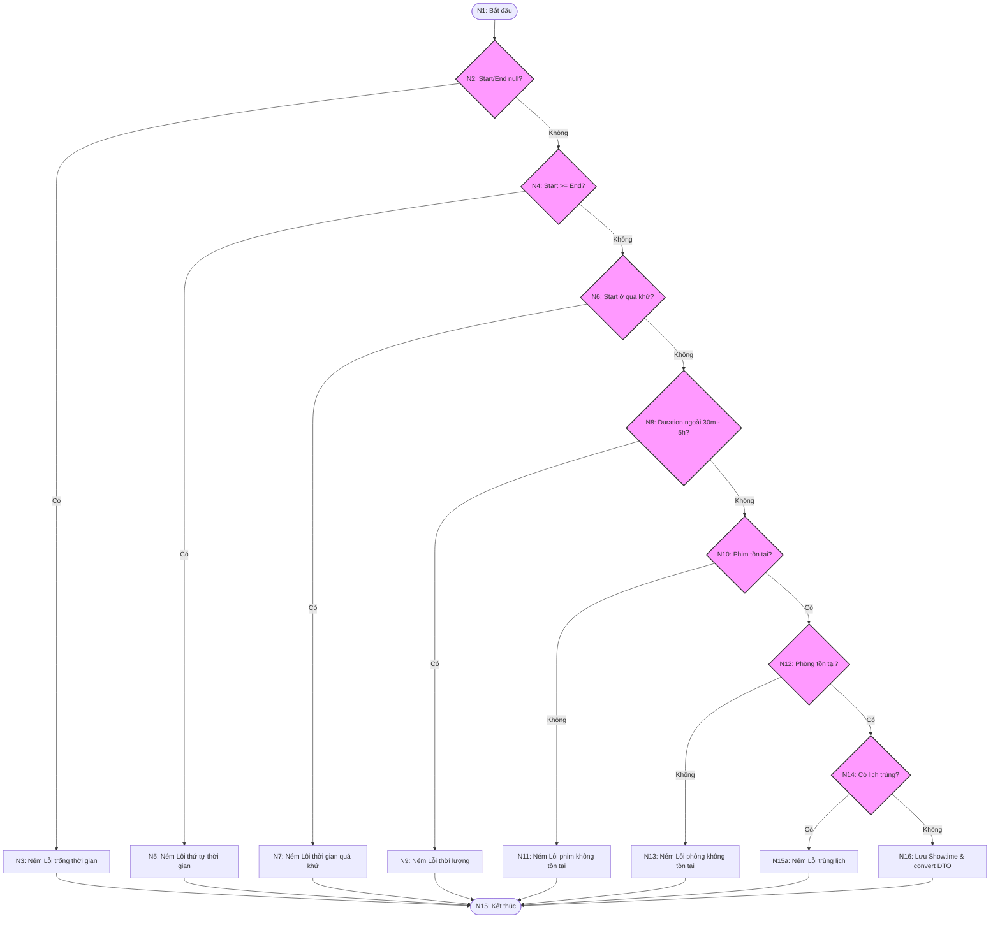

# KIỂM THỬ HỘP TRẮNG HÀM `createShowtime`

Tài liệu này chứa báo cáo phân tích và thiết kế kịch bản kiểm thử hộp trắng (White-box Testing) cho phương thức `createShowtime` thuộc lớp [ShowtimeServiceImpl](file:///d:/NNLTTT/FinalProject/MeCinema/src/main/java/com/mecinema/mecinema/service/impl/ShowtimeServiceImpl.java).

---

## 6.12.1. Mã nguồn chi tiết của hàm

Phương thức `createShowtime` và phương thức bổ trợ `validateShowtimeTime` được định nghĩa trong [ShowtimeServiceImpl.java](file:///d:/NNLTTT/FinalProject/MeCinema/src/main/java/com/mecinema/mecinema/service/impl/ShowtimeServiceImpl.java#L52-L87) như sau:

```java
    @Override
    public ShowtimeDTO createShowtime(CreateShowtimeRequest request) {
        // Validate time
        validateShowtimeTime(request.getStartTime(), request.getEndTime());
        
        // Fetch movie
        Movie movie = movieRepository.findById(request.getMovieId())
                .orElseThrow(() -> new RuntimeException("Bộ phim không tồn tại với ID: " + request.getMovieId()));
        
        // Fetch room
        Room room = roomRepository.findById(request.getRoomId())
                .orElseThrow(() -> new RuntimeException("Phòng chiếu không tồn tại với ID: " + request.getRoomId()));
        
        // Check for conflicting showtimes
        List<Showtime> conflicts = showtimeRepository.findConflictingShowtimes(
                room.getId(), 
                request.getStartTime(), 
                request.getEndTime()
        );
        
        if (!conflicts.isEmpty()) {
            throw new RuntimeException("Phòng chiếu đã có lịch chiếu trong thời gian này. Vui lòng chọn thời gian khác.");
        }
        
        // Create showtime
        Showtime showtime = Showtime.builder()
                .movie(movie)
                .room(room)
                .startTime(request.getStartTime())
                .endTime(request.getEndTime())
                .basePrice(request.getBasePrice())
                .build();
        
        showtime = showtimeRepository.save(showtime);

        return convertToDTO(showtime);
    }
```

Hàm validate thời gian bổ trợ trong cùng class:
```java
    private void validateShowtimeTime(LocalDateTime startTime, LocalDateTime endTime) {
        if (startTime == null || endTime == null) {
            throw new RuntimeException("Thời gian bắt đầu và kết thúc không được để trống");
        }
        
        if (!startTime.isBefore(endTime)) {
            throw new RuntimeException("Thời gian bắt đầu phải trước thời gian kết thúc");
        }
        
        if (startTime.isBefore(LocalDateTime.now())) {
            throw new RuntimeException("Thời gian bắt đầu không được ở quá khứ");
        }
        
        // Check duration (should be between 30 minutes and 5 hours)
        long durationMinutes = java.time.temporal.ChronoUnit.MINUTES.between(startTime, endTime);
        if (durationMinutes < 30 || durationMinutes > 300) {
            throw new RuntimeException("Thời lượng lịch chiếu phải từ 30 phút đến 5 giờ");
        }
    }
```

---

## 6.12.2. Đồ thị dòng điều khiển cơ bản (Control Flow Graph - CFG)

Do `validateShowtimeTime` là một hàm private bổ trợ nội bộ được gọi ngay đầu hàm `createShowtime`, luồng điều khiển của nó trực tiếp quyết định sự rẽ nhánh của `createShowtime`. Do đó, đồ thị dòng điều khiển sẽ biểu diễn kết hợp cả hai hàm để đảm bảo tính toàn diện của luồng kiểm thử hộp trắng.

### 1. Danh sách các nút (Nodes) trong đồ thị

*   **Nút 1 (N1):** Bắt đầu hàm (Entry), đi vào hàm kiểm tra thời gian `validateShowtimeTime`.
*   **Nút 2 (N2 - Predicate Node):** Kiểm tra `startTime == null || endTime == null`?
    *   *Đúng (null):* Đi tới **Nút 3**.
    *   *Sai (khác null):* Đi tới **Nút 4**.
*   **Nút 3 (N3):** Ném ngoại lệ `"Thời gian bắt đầu và kết thúc không được để trống"`. Đi tới **Unified Exit (N15)**.
*   **Nút 4 (N4 - Predicate Node):** Kiểm tra `!startTime.isBefore(endTime)` (Thời gian bắt đầu lớn hơn hoặc bằng thời gian kết thúc)?
    *   *Đúng:* Đi tới **Nút 5**.
    *   *Sai:* Đi tới **Nút 6**.
*   **Nút 5 (N5):** Ném ngoại lệ `"Thời gian bắt đầu phải trước thời gian kết thúc"`. Đi tới **Unified Exit (N15)**.
*   **Nút 6 (N6 - Predicate Node):** Kiểm tra `startTime.isBefore(LocalDateTime.now())` (Thời gian bắt đầu ở quá khứ)?
    *   *Đúng:* Đi tới **Nút 7**.
    *   *Sai:* Đi tới **Nút 8**.
*   **Nút 7 (N7):** Ném ngoại lệ `"Thời gian bắt đầu không được ở quá khứ"`. Đi tới **Unified Exit (N15)**.
*   **Nút 8 (N8 - Predicate Node):** Tính toán khoảng thời gian và kiểm tra xem có nằm ngoài khoảng 30 phút tới 5 tiếng hay không (`durationMinutes < 30 || durationMinutes > 300`)?
    *   *Đúng (quá ngắn hoặc quá dài):* Đi tới **Nút 9**.
    *   *Sai (hợp lệ):* Đi tới **Nút 10**.
*   **Nút 9 (N9):** Ném ngoại lệ `"Thời lượng lịch chiếu phải từ 30 phút đến 5 giờ"`. Đi tới **Unified Exit (N15)**.
*   **Nút 10 (N10 - Predicate Node):** Gọi `movieRepository.findById(...)` tìm bộ phim. Bộ phim có tồn tại?
    *   *Không tồn tại:* Đi tới **Nút 11**.
    *   *Có tồn tại:* Đi tới **Nút 12**.
*   **Nút 11 (N11):** Ném ngoại lệ `"Bộ phim không tồn tại với ID: ..."`. Đi tới **Unified Exit (N15)**.
*   **Nút 12 (N12 - Predicate Node):** Gọi `roomRepository.findById(...)` tìm phòng chiếu. Phòng chiếu có tồn tại?
    *   *Không tồn tại:* Đi tới **Nút 13**.
    *   *Có tồn tại:* Đi tới **Nút 14**.
*   **Nút 13 (N13):** Ném ngoại lệ `"Phòng chiếu không tồn tại với ID: ..."`. Đi tới **Unified Exit (N15)**.
*   **Nút 14 (N14 - Predicate Node):** Gọi `showtimeRepository.findConflictingShowtimes(...)`. Danh sách xung đột `conflicts` có rỗng hay không (`!conflicts.isEmpty()`)?
    *   *Có xung đột:* Đi tới **Nút 15a**.
    *   *Không xung đột:* Đi tới **Nút 16**.
*   **Nút 15a (N15a):** Ném ngoại lệ `"Phòng chiếu đã có lịch chiếu trong thời gian này. Vui lòng chọn thời gian khác."`. Đi tới **Unified Exit (N15)**.
*   **Nút 16 (N16):** Xây dựng đối tượng `Showtime`, gọi `showtimeRepository.save(showtime)` và `convertToDTO(showtime)` để trả về kết quả thành công. Đi tới **Unified Exit (N15)**.
*   **Nút 15 (N15 - Unified Exit):** Kết thúc chương trình.

---

### 2. Biểu đồ dòng điều khiển (Mermaid Flowchart)



---

## 6.12.3. Tính toán độ phức tạp Cyclomatic

Chúng ta tính toán Độ phức tạp McCabe Cyclomatic ($V(G)$) cho phương thức bằng 3 phương pháp tiêu chuẩn:

### Phương pháp 1: Dựa trên số cạnh (Edges) và số nút (Nodes)
Công thức:
$$V(G) = E - V + 2P$$
Trong đó:
*   $E$ là số cạnh trong đồ thị: $E = 23$ cạnh.
    *(Các cạnh: $1 \to 2$, $2 \to 3$, $2 \to 4$, $3 \to 15$, $4 \to 5$, $4 \to 6$, $5 \to 15$, $6 \to 7$, $6 \to 8$, $7 \to 15$, $8 \to 9$, $8 \to 10$, $9 \to 15$, $10 \to 11$, $10 \to 12$, $11 \to 15$, $12 \to 13$, $12 \to 14$, $13 \to 15$, $14 \to 15a$, $14 \to 16$, $15a \to 15$, $16 \to 15$)*
*   $V$ là số nút trong đồ thị: $V = 17$ nút.
    *(Các nút: $N_1, N_2, N_3, N_4, N_5, N_6, N_7, N_8, N_9, N_{10}, N_{11}, N_{12}, N_{13}, N_{14}, N_{15a}, N_{16}, N_{15}$)*
*   $P$ là số thành phần liên thông: $P = 1$.

Thay số vào công thức:
$$V(G) = 23 - 17 + 2(1) = 8$$

### Phương pháp 2: Dựa trên số nút quyết định (Predicate Nodes)
Công thức:
$$V(G) = d + 1$$
Trong đó $d$ là số nút quyết định rẽ luồng thực thi trong đồ thị. Hàm có 7 nút quyết định:
1.  **N2:** Kiểm tra thời gian null.
2.  **N4:** Kiểm tra start >= end.
3.  **N6:** Kiểm tra start ở quá khứ.
4.  **N8:** Kiểm tra thời lượng (duration) ngoài [30m, 5h].
5.  **N10:** Kiểm tra phim tồn tại.
6.  **N12:** Kiểm tra phòng tồn tại.
7.  **N14:** Kiểm tra lịch chiếu trùng lặp.

Số nút quyết định $d = 7$. Thay số vào công thức:
$$V(G) = 7 + 1 = 8$$

### Phương pháp 3: Dựa trên số vùng phẳng (Regions)
Đồ thị phân hoạch mặt phẳng phẳng thành 8 vùng độc lập:
*   **Vùng 1:** Giới hạn bởi đường đi $N_2 \to N_3 \to N_{15}$ và luồng chính.
*   **Vùng 2:** Giới hạn bởi đường đi $N_4 \to N_5 \to N_{15}$ và luồng chính.
*   **Vùng 3:** Giới hạn bởi đường đi $N_6 \to N_7 \to N_{15}$ và luồng chính.
*   **Vùng 4:** Giới hạn bởi đường đi $N_8 \to N_9 \to N_{15}$ và luồng chính.
*   **Vùng 5:** Giới hạn bởi đường đi $N_{10} \to N_{11} \to N_{15}$ và luồng chính.
*   **Vùng 6:** Giới hạn bởi đường đi $N_{12} \to N_{13} \to N_{15}$ và luồng chính.
*   **Vùng 7:** Giới hạn bởi đường đi $N_{14} \to N_{15a} \to N_{15}$ và đường đi thành công $N_{14} \to N_{16} \to N_{15}$.
*   **Vùng 8:** Vùng không gian mở vô hạn bên ngoài đồ thị.

Số vùng phẳng $R = 8$. Theo lý thuyết đồ thị:
$$V(G) = R = 8$$

### Kết luận
Cả 3 phương pháp đều thống nhất độ phức tạp McCabe Cyclomatic của hàm là **$V(G) = 8$**. Cần thiết kế đúng **8 kịch bản kiểm thử (Test Cases)** độc lập để đạt độ bao phủ toàn diện 100% các nhánh.

---

## 6.12.4. Thiết kế bộ Test Case đối với mỗi nhánh độc lập

### 1. Danh sách các đường đi độc lập (Basis Paths)

*   **Path 1:** $N_1 \to N_2 \to N_3 \to N_{15}$
    *   *Kịch bản:* Nhập dữ liệu thời gian bắt đầu hoặc kết thúc bằng `null`. Ném lỗi `"Thời gian bắt đầu và kết thúc không được để trống"`.
*   **Path 2:** $N_1 \to N_2 \to N_4 \to N_5 \to N_{15}$
    *   *Kịch bản:* Thời gian bắt đầu muộn hơn hoặc bằng thời gian kết thúc. Ném lỗi `"Thời gian bắt đầu phải trước thời gian kết thúc"`.
*   **Path 3:** $N_1 \to N_2 \to N_4 \to N_6 \to N_7 \to N_{15}$
    *   *Kịch bản:* Thời gian bắt đầu ở quá khứ so với thời điểm chạy hệ thống. Ném lỗi `"Thời gian bắt đầu không được ở quá khứ"`.
*   **Path 4:** $N_1 \to N_2 \to N_4 \to N_6 \to N_8 \to N_9 \to N_{15}$
    *   *Kịch bản:* Thời lượng suất chiếu ngắn hơn 30 phút hoặc dài hơn 5 tiếng. Ném lỗi `"Thời lượng lịch chiếu phải từ 30 phút đến 5 giờ"`.
*   **Path 5:** $N_1 \to N_2 \to N_4 \to N_6 \to N_8 \to N_{10} \to N_{11} \to N_{15}$
    *   *Kịch bản:* Phim ID không tồn tại. Ném lỗi `"Bộ phim không tồn tại với ID: ... "`.
*   **Path 6:** $N_1 \to N_2 \to N_4 \to N_6 \to N_8 \to N_{10} \to N_{12} \to N_{13} \to N_{15}$
    *   *Kịch bản:* Phòng ID không tồn tại. Ném lỗi `"Phòng chiếu không tồn tại với ID: ... "`.
*   **Path 7:** $N_1 \to N_2 \to N_4 \to N_6 \to N_8 \to N_{10} \to N_{12} \to N_{14} \to N_{15a} \to N_{15}$
    *   *Kịch bản:* Phòng chiếu đã có suất chiếu khác trùng khoảng giờ. Ném lỗi `"Phòng chiếu đã có lịch chiếu trong thời gian này. Vui lòng chọn thời gian khác."`.
*   **Path 8:** $N_1 \to N_2 \to N_4 \to N_6 \to N_8 \to N_{10} \to N_{12} \to N_{14} \to N_{16} \to N_{15}$
    *   *Kịch bản:* Tạo lịch chiếu thành công và trả về DTO.

---

### 2. Thiết kế chi tiết các Test Cases

*(Lưu ý: Để tránh việc thời gian chạy kiểm thử bị lệch so với thời gian hiện tại của JVM dẫn đến lỗi rẽ nhánh không mong muốn, các mốc thời gian kiểm thử được thiết lập động ở tương lai từ `LocalDateTime.now().plusDays(...)`)*

#### TC_WBT_009 (Bao phủ Path 1): Thất bại do thời gian start/end null

| **Test Case ID** | **TC_WBT_009** | **Test Case Description** | **Kiểm tra tạo suất chiếu thất bại khi thời gian bắt đầu hoặc kết thúc bị null** |
| :--- | :--- | :--- | :--- |
| **Tested Function** | `createShowtime` | **Type of Test** | White-box / Path Coverage (Path 1) |

*   **Input Data:** `movieId = 1L`, `roomId = 1L`, `startTime = null`, `endTime = LocalDateTime.now().plusDays(1)`, `basePrice = 90000`
*   **Expected Result:** Ném ngoại lệ `RuntimeException` chứa thông điệp `"Thời gian bắt đầu và kết thúc không được để trống"`.

---

#### TC_WBT_010 (Bao phủ Path 2): Thất bại do thời gian start >= end

| **Test Case ID** | **TC_WBT_010** | **Test Case Description** | **Kiểm tra tạo suất chiếu thất bại khi thời gian bắt đầu muộn hơn hoặc bằng kết thúc** |
| :--- | :--- | :--- | :--- |
| **Tested Function** | `createShowtime` | **Type of Test** | White-box / Path Coverage (Path 2) |

*   **Input Data:** `movieId = 1L`, `roomId = 1L`, `startTime = LocalDateTime.now().plusDays(1).plusHours(2)`, `endTime = LocalDateTime.now().plusDays(1)`, `basePrice = 90000`
*   **Expected Result:** Ném ngoại lệ `RuntimeException` chứa thông điệp `"Thời gian bắt đầu phải trước thời gian kết thúc"`.

---

#### TC_WBT_011 (Bao phủ Path 3): Thất bại do thời gian start ở quá khứ

| **Test Case ID** | **TC_WBT_011** | **Test Case Description** | **Kiểm tra tạo suất chiếu thất bại khi thời gian bắt đầu ở quá khứ** |
| :--- | :--- | :--- | :--- |
| **Tested Function** | `createShowtime` | **Type of Test** | White-box / Path Coverage (Path 3) |

*   **Input Data:** `movieId = 1L`, `roomId = 1L`, `startTime = LocalDateTime.now().minusHours(1)`, `endTime = LocalDateTime.now().plusHours(1)`, `basePrice = 90000`
*   **Expected Result:** Ném ngoại lệ `RuntimeException` chứa thông điệp `"Thời gian bắt đầu không được ở quá khứ"`.

---

#### TC_WBT_012 (Bao phủ Path 4): Thất bại do thời lượng suất chiếu không hợp lệ (Dưới 30m hoặc trên 5h)

| **Test Case ID** | **TC_WBT_012** | **Test Case Description** | **Kiểm tra tạo suất chiếu thất bại khi thời lượng quá ngắn (< 30 phút) hoặc quá dài (> 5 giờ)** |
| :--- | :--- | :--- | :--- |
| **Tested Function** | `createShowtime` | **Type of Test** | White-box / Path Coverage (Path 4) |

*   **Input Data:** `movieId = 1L`, `roomId = 1L`, `startTime = LocalDateTime.now().plusDays(1)`, `endTime = LocalDateTime.now().plusDays(1).plusMinutes(20)`, `basePrice = 90000`
*   **Expected Result:** Ném ngoại lệ `RuntimeException` chứa thông điệp `"Thời lượng lịch chiếu phải từ 30 phút đến 5 giờ"`.

---

#### TC_WBT_013 (Bao phủ Path 5): Thất bại do phim ID không tồn tại

| **Test Case ID** | **TC_WBT_013** | **Test Case Description** | **Kiểm tra tạo suất chiếu thất bại khi bộ phim ID không tồn tại** |
| :--- | :--- | :--- | :--- |
| **Tested Function** | `createShowtime` | **Type of Test** | White-box / Path Coverage (Path 5) |

*   **Input Data:** `movieId = 999L`, `roomId = 1L`, `startTime = LocalDateTime.now().plusDays(1)`, `endTime = LocalDateTime.now().plusDays(1).plusHours(2)`, `basePrice = 90000`
*   **Mock Behavior:** `movieRepository.findById(999L)` trả về `Optional.empty()`.
*   **Expected Result:** Ném ngoại lệ `RuntimeException` chứa thông điệp `"Bộ phim không tồn tại với ID: 999"`.

---

#### TC_WBT_014 (Bao phủ Path 6): Thất bại do phòng chiếu ID không tồn tại

| **Test Case ID** | **TC_WBT_014** | **Test Case Description** | **Kiểm tra tạo suất chiếu thất bại khi phòng chiếu ID không tồn tại** |
| :--- | :--- | :--- | :--- |
| **Tested Function** | `createShowtime` | **Type of Test** | White-box / Path Coverage (Path 6) |

*   **Input Data:** `movieId = 1L`, `roomId = 888L`, `startTime = LocalDateTime.now().plusDays(1)`, `endTime = LocalDateTime.now().plusDays(1).plusHours(2)`, `basePrice = 90000`
*   **Mock Behavior:**
    *   `movieRepository.findById(1L)` trả về `Optional.of(new Movie())`.
    *   `roomRepository.findById(888L)` trả về `Optional.empty()`.
*   **Expected Result:** Ném ngoại lệ `RuntimeException` chứa thông điệp `"Phòng chiếu không tồn tại với ID: 888"`.

---

#### TC_WBT_015 (Bao phủ Path 7): Thất bại do trùng lịch chiếu (Conflicting showtimes)

| **Test Case ID** | **TC_WBT_015** | **Test Case Description** | **Kiểm tra tạo suất chiếu thất bại khi thời gian bị trùng lặp với lịch chiếu có sẵn** |
| :--- | :--- | :--- | :--- |
| **Tested Function** | `createShowtime` | **Type of Test** | White-box / Path Coverage (Path 7) |

*   **Input Data:** `movieId = 1L`, `roomId = 1L`, `startTime = LocalDateTime.now().plusDays(1)`, `endTime = LocalDateTime.now().plusDays(1).plusHours(2)`, `basePrice = 90000`
*   **Mock Behavior:**
    *   `movieRepository.findById(1L)` trả về `Optional.of(new Movie())`.
    *   `roomRepository.findById(1L)` trả về `Optional.of(new Room())`.
    *   `showtimeRepository.findConflictingShowtimes(any(), any(), any())` trả về danh sách chứa ít nhất 1 thực thể `Showtime` (có xung đột).
*   **Expected Result:** Ném ngoại lệ `RuntimeException` chứa thông điệp `"Phòng chiếu đã có lịch chiếu trong thời gian này. Vui lòng chọn thời gian khác."`.

---

#### TC_WBT_016 (Bao phủ Path 8): Tạo suất chiếu thành công

| **Test Case ID** | **TC_WBT_016** | **Test Case Description** | **Kiểm tra tạo suất chiếu thành công khi tất cả thông tin hợp lệ** |
| :--- | :--- | :--- | :--- |
| **Tested Function** | `createShowtime` | **Type of Test** | White-box / Path Coverage (Path 8) |

*   **Input Data:** `movieId = 1L`, `roomId = 1L`, `startTime = LocalDateTime.now().plusDays(1)`, `endTime = LocalDateTime.now().plusDays(1).plusHours(2)`, `basePrice = 90000`
*   **Mock Behavior:**
    *   `movieRepository.findById(1L)` trả về `Optional.of(movieMock)`.
    *   `roomRepository.findById(1L)` trả về `Optional.of(roomMock)`.
    *   `showtimeRepository.findConflictingShowtimes(any(), any(), any())` trả về danh sách rỗng (không xung đột).
    *   `showtimeRepository.save(any(Showtime.class))` trả về thực thể `Showtime` đã lưu.
*   **Expected Result:** Trả về `ShowtimeDTO` đầy đủ thông tin của suất chiếu vừa tạo.
